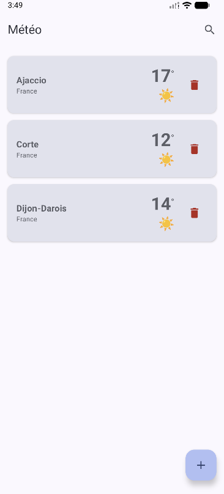
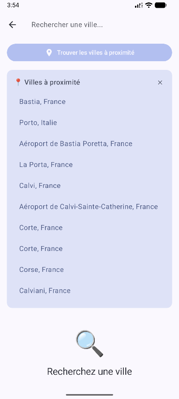
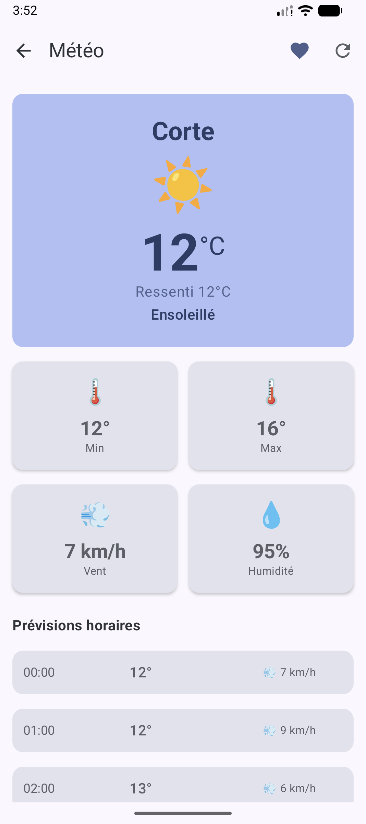
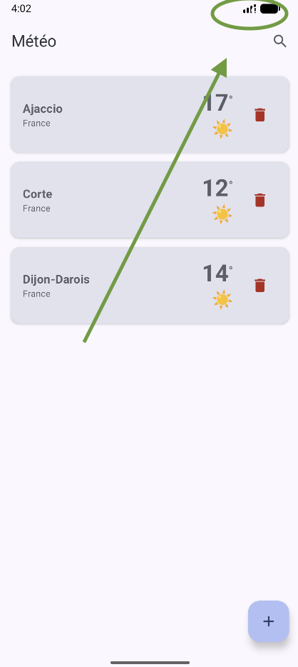
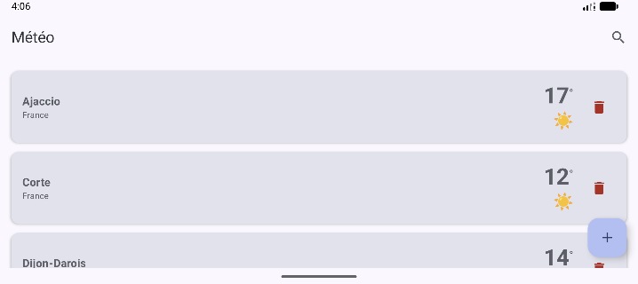

# 🌤️ Application Météo Android

Application Android prévisions météorologiques.

Créer par Anthony Menghi alias antocreadev.

TP Univerité de Corse - 2025.

##### 1. Écran d’accueil comportant une barre de recherche ainsi que le résumé météorologique des villes ajoutées en favoris.

##### 2. Système de recherche de ville en utilisant l’API de geocoding open-meteo.com

##### 3. Une option devra être disponible pour rechercher la météo à partir de la géolocalisation de l’utilisateur

##### 4. Écran de détail des prévisions météorologiques de la ville sélectionnée. Afficher au moins les éléments suivants :

- Température actuelle
- Conditions météorologiques (ensoleillé, nuageux, pluie)
- Températures minimale et maximale
- Vitesse du vent

##### 5. L’utilisateur devra être capable d’ajouter et supprimer une ville de ses favoris

##### 6. Gestion du cache :

- mise en cache des résultats de requête, des favoris etc
- l’application devra pouvoir fonctionner en mode hors connexion
  

##### 7. Gestion des erreurs API et réseau (timeout ou hors connexion)

##### 8. Gestion de la rotation de l’écran

# Critères d'évaluation

## Fonctionnalités obligatoires

**Toutes les fonctionnalités demandées sont implémentées et fonctionnelles** (voir captures d'écran ci-dessus) :

- ✅ Écran d'accueil avec liste des favoris
- ✅ Système de recherche de villes (API Geocoding Open-Meteo)
- ✅ Géolocalisation avec détection automatique des villes proches
- ✅ Écran détaillé avec température, conditions, min/max, vent, humidité, précipitations et prévisions horaires
- ✅ Ajout/suppression de favoris avec persistance en base de données Room
- ✅ Cache intelligent (30 min de validité, mode hors ligne)
- ✅ Gestion des erreurs réseau et API avec messages clairs
- ✅ Support de la rotation d'écran (architecture MVVM avec StateFlow)

## Qualité du code

**Architecture moderne et maintenable** :

- **Clean Architecture** : séparation en 3 couches (data/domain/ui) pour une meilleure testabilité et évolution
- **MVVM Pattern** : ViewModels réactifs avec StateFlow pour une UI prévisible et sans fuite mémoire
- **Dependency Injection** : Hilt pour une injection propre et découplée des dépendances
- **Repository Pattern** : abstraction de la source de données (API + Cache) avec stratégie stale-while-revalidate
- **Kotlin Coroutines** : gestion asynchrone moderne sans callback hell
- **Immutabilité** : data classes et StateFlow pour un état prévisible
- **Nommage explicite** : fonctions et variables auto-documentées
- **Commentaires KDoc** : documentation complète de toutes les classes et méthodes publiques

## Tests et robustesse

**Application stable et résiliente** :

- **Gestion exhaustive des erreurs** : try-catch avec fallback sur cache en cas d'erreur réseau
- **Validation des entrées** : minimum 3 caractères pour la recherche (fuzzy matching API)
- **Champs optionnels** : tous les DTOs gèrent les valeurs nulles de l'API (country, température, etc.)
- **Cache stratégique** : sauvegarde automatique pour fonctionnement hors ligne
- **Flow réactifs** : combine() pour synchronisation automatique favoris + cache météo
- **Debounce** : évite les appels API excessifs lors de la saisie (300ms)
- **Tracking du loading** : Set pour gérer précisément l'état de chargement par ville
- **Finally blocks** : garantit l'arrêt des loaders même en cas d'exception

## Interface et expérience utilisateur

**UI intuitive et fluide** :

- **Material Design 3** : composants modernes et cohérents (Cards, TopAppBar, FAB, etc.)
- **Navigation claire** : Navigation Compose avec transitions fluides entre écrans
- **Feedback visuel** : loaders (LinearProgressIndicator, CircularProgressIndicator) pendant les chargements
- **États visuels distincts** : Idle, Loading, Success, Error avec icônes et messages appropriés
- **Gestion des permissions** : demande automatique et élégante des permissions de localisation
- **Pull-to-refresh implicite** : rechargement automatique si cache expiré
- **Recherche temps réel** : résultats instantanés avec debounce pour performance
- **Cartes interactives** : affichage clair des villes proches avec possibilité de fermer
- **Typographie adaptative** : hiérarchie visuelle claire (température en grand, détails en petit)

## Gestion des erreurs

**Messages clairs et contextuels** :

- **Erreur réseau** : "Pas de connexion internet" ou "Erreur réseau. Vérifiez votre connexion."
- **Erreur API** : messages HTTP détaillés (429 "Trop de requêtes", 500 "Erreur serveur")
- **Recherche vide** : "Aucune ville trouvée pour 'X'" avec emoji 😕
- **Permissions refusées** : "Permission de localisation refusée" avec possibilité de réessayer
- **Position introuvable** : "Impossible d'obtenir votre position" avec Card d'erreur dismissible
- **Mode hors ligne** : fallback automatique sur cache avec indication visuelle
- **Cache expiré** : "Pas de connexion et aucune donnée en cache" uniquement si vraiment aucune donnée
- **Chargement échoué** : les favoris restent affichés même si le refresh échoue (données en cache)
- **UI non-bloquante** : toutes les erreurs sont affichées sans crasher l'application
